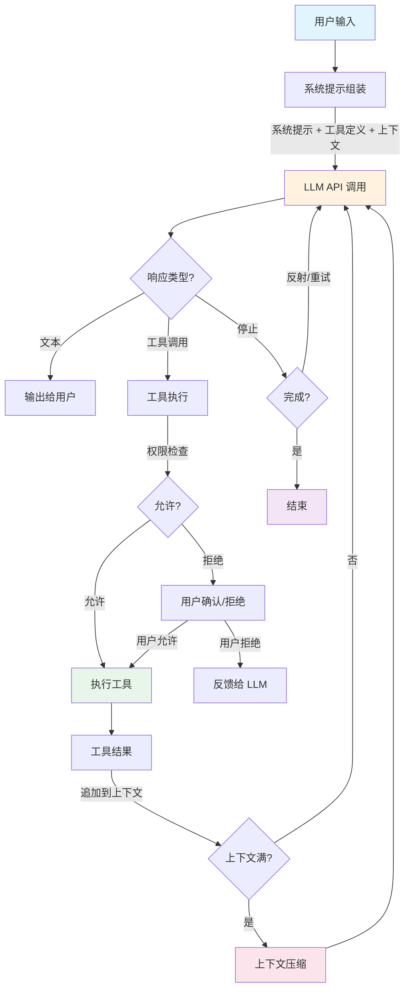
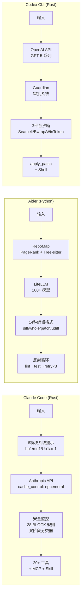
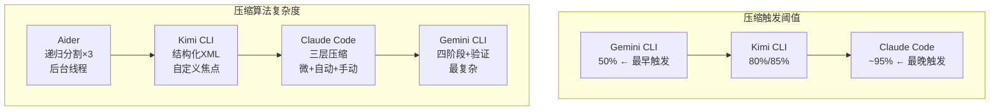

# 2. Code Agent 架构深度对比（源码级分析）

> 基于 9 个开源项目本地源码的深入分析，对比 AI 编程代理的核心架构设计

## 通用代理循环架构图



## 各工具架构差异



## 上下文管理对比



## 分析范围

| 项目 | 语言 | 代码量 | 本地路径 |
|------|------|--------|---------|
| Aider | Python | ~30k 行 | `/root/git/aider` |
| Goose | Rust | ~55k 行 | `/root/git/goose` |
| Gemini CLI | TypeScript | ~191k 行 | `/root/git/gemini-cli` |
| Qwen Code | TypeScript | ~191k 行（分叉） | `/root/git/qwen-code` |
| OpenCode | Go + TypeScript | ~50k 行 | `/root/git/opencode` |
| Cline | TypeScript | ~40k 行 | `/root/git/cline` |
| SWE-agent | Python | ~20k 行 | `/root/git/swe-agent` |
| OpenHands | Python | ~60k 行 | `/root/git/openhands` |
| Continue | TypeScript | ~80k 行 | `/root/git/continue` |
| Kimi CLI | Python | ~20k 行 | `/root/git/kimi-cli` |
| Claude Code | Rust | 专有 | `/root/git/claude-code` |

---

## 1. 代理循环模式

所有工具的核心都是一个代理循环，但实现方式差异显著：

### 纯 ReAct 循环

```
思考 → 行动 → 观察 → 重复
```

**使用者**：Gemini CLI、Qwen Code、SWE-agent

- Gemini CLI 的 `GeminiClient` 最多 100 轮，通过 `Scheduler` 调度工具
- SWE-agent 的 `DefaultAgent.step()` 逐步执行，支持多种解析器
- Qwen Code 继承 Gemini CLI 架构，增加了 Loop 检测（Levenshtein 距离）

### 编辑-提交循环

```
发送 → 解析编辑 → 应用修改 → Git 提交 → Lint/测试 → 反思
```

**使用者**：Aider

- 独特的编辑格式系统（14 种），模型输出直接包含代码修改
- 反思循环：lint/测试失败自动重试（最多 3 次）
- 每次修改自动 Git 提交，天然版本控制

### 工具调用循环

```
消息 → LLM → 工具调用 → 执行 → 结果 → 重复
```

**使用者**：Claude Code、OpenCode、Cline、Goose

- Claude Code/OpenCode 使用结构化工具调用（function calling）
- Cline 在 VS Code 内执行，每步自动 Git Checkpoint
- Goose 通过 MCP 协议统一工具接口

### 事件驱动循环

```
Action → EventStream → Runtime → Observation → 订阅者通知
```

**使用者**：OpenHands

- 最复杂的架构：EventStream 发布/订阅总线
- Action 和 Observation 完全解耦
- 支持多代理委托和异步执行

---

## 2. LLM 接入策略

### 策略对比

| 策略 | 实现方式 | 支持提供商 | 使用者 |
|------|---------|-----------|--------|
| **LiteLLM 统一** | Python 包装 100+ 模型 | 100+ | Aider, SWE-agent, OpenHands |
| **Vercel AI SDK** | TS SDK 统一 streamText() + models.dev 动态加载 | 100+ | OpenCode（TUI 层） |
| **独立 Generator** | 每个提供商独立实现 | 3-5 | Qwen Code, Gemini CLI |
| **Provider trait** | Rust trait 抽象 | 58+ | Goose |
| **Handler 工厂** | 每个提供商一个 Handler | 48+ | Cline |
| **单提供商** | 直连特定 API | 1 | Claude Code |

### 模型选择与路由

| 工具 | 模型路由 | 弱模型 | 回退 |
|------|---------|--------|------|
| **Aider** | model-settings.yml 预配置 | ✓（历史摘要用便宜模型） | 手动切换 |
| **Gemini CLI** | ModelRouterService（Fallback/Override/Classifier） | | ✓ 自动回退链 |
| **Goose** | 模型注册表 | ✓（轻量操作） | 手动切换 |
| **SWE-agent** | 配置驱动 + 多 Key 负载均衡 | | ✓ LiteLLM fallbacks |
| **其他** | 单模型或手动选择 | | |

---

## 3. 工具系统设计

### 工具数量与类型

| 工具 | 内置工具数 | 文件操作 | Bash | 搜索 | Web | 浏览器 | MCP |
|------|-----------|---------|------|------|-----|--------|-----|
| **Aider** | ~15 命令 | ✓ | ✓ | ✓ | ✓ | | |
| **Goose** | MCP 驱动 | ✓ | ✓ | | ✓ | ✓（截图） | ✓ 原生 |
| **Gemini CLI** | 27+ | ✓ | ✓ | ✓ | ✓ | | ✓ |
| **Qwen Code** | 16 | ✓ | ✓ | ✓ | ✓ | | ✓ |
| **OpenCode** | 40+ | ✓ | ✓ | ✓ | ✓ | | ✓ |
| **Cline** | 23 | ✓ | ✓ | ✓ | ✓ | ✓（Headless） | ✓ |
| **SWE-agent** | Bundle 驱动 | ✓ | ✓ | ✓ | ✓ | | |
| **OpenHands** | 8 核心 | ✓ | ✓ | | ✓ | ✓（Playwright） | ✓ |

### 工具定义模式

| 模式 | 定义方式 | 校验 | 使用者 |
|------|---------|------|--------|
| **声明式类** | TypeScript 抽象类 | Zod / FunctionDeclaration | Gemini CLI, Qwen Code, OpenCode |
| **Rust trait** | rmcp::Tool | JSON Schema | Goose |
| **Python dataclass** | @dataclass Action | Pydantic | OpenHands, SWE-agent |
| **YAML Bundle** | 配置文件定义 | 参数类型校验 | SWE-agent |
| **无正式注册** | 命令行解析 | configargparse | Aider |

### 编辑策略

| 工具 | 编辑方式 | 特色 |
|------|---------|------|
| **Aider** | 14 种编辑格式（whole/diff/udiff/patch/architect...） | 按模型能力自动选择 |
| **Claude Code** | 原生编辑工具 | 差异预览 |
| **OpenCode** | edit + apply_patch（GPT 专用） | 按模型切换 |
| **Cline** | replace_in_file (search/replace) + write_to_file | Checkpoint 回滚 |
| **Gemini CLI** | edit 工具（声明式） | 策略审批 |
| **SWE-agent** | str_replace_editor (Bundle) | 支持 undo_edit |
| **OpenHands** | StrReplaceEditorTool + LLMBasedFileEditTool | 双编辑模式 |

---

## 4. 权限与安全

### 安全模型对比

| 工具 | 权限模型 | 策略格式 | 特殊能力 |
|------|---------|---------|---------|
| **Claude Code** | 精细工具权限 | 配置文件 | 沙箱网络控制 |
| **OpenCode** | 分层规则 (allow/deny/ask) | JSON | Tree-sitter bash AST 分析 |
| **Gemini CLI** | PolicyEngine | TOML | 外挂安全检查器进程 |
| **Qwen Code** | deny > ask > allow > default | JSON | Hook 拦截权限请求 |
| **Cline** | 命令权限控制器 | 正则 + 设置 | 重定向/子 shell 检测 |
| **Goose** | 四模式 (Auto/Approve/Smart/Chat) | YAML | 环境变量白名单（31 项） |
| **SWE-agent** | Docker 沙箱隔离 | 配置 | 命令超时 + 成本上限 |
| **OpenHands** | 三层安全分析 | 配置 + 外部 | LLM 风险 + Invariant + GraySwan |
| **Aider** | 信任模式 | 无 | 用户确认 shell 命令 |

### 创新安全特性

| 特性 | 工具 | 说明 |
|------|------|------|
| **Tree-sitter Bash 分析** | OpenCode | AST 级解析命令，自动提取目录和操作 |
| **TOML 策略引擎** | Gemini CLI | 通配符 + 正则 + 四种审批模式 |
| **Doom Loop 保护** | OpenCode | 3 次连续拒绝自动中断 |
| **Loop 检测** | Qwen Code | Levenshtein 距离检测重复调用 |
| **三层安全分析** | OpenHands | LLM 风险评估 + 策略检查 + 外部监控 |
| **环境变量白名单** | Goose | 31 个危险变量禁止注入 |
| **Git Checkpoint** | Cline | 每步操作 Git 快照，一键回滚 |
| **重定向检测** | Cline | 检测 >, >>, |, &&, 子 shell |

---

## 5. 上下文管理

### 上下文窗口策略

| 工具 | 最大上下文 | 压缩策略 | 特殊优化 |
|------|-----------|---------|---------|
| **Claude Code** | 100 万 token | 自动压缩 | 最大上下文窗口 |
| **Aider** | 按模型 | ChatChunks 分块 + 弱模型摘要 | Prompt 缓存保活 ping |
| **Gemini CLI** | ~100 万 | ChatCompressionService | 思维链不回传 |
| **Qwen Code** | ~100 万 | ChatCompressionService（继承） | Token 阈值触发 |
| **OpenCode** | 按模型 | 会话压缩 | 工具输出 32K 截断 |
| **Cline** | 按模型 | Hook 压缩 | 扩展思维预算控制 |
| **SWE-agent** | 按模型 | HistoryProcessor（LastN/CacheControl） | 成本上限 $3/实例 |
| **OpenHands** | 按模型 | 递归对话压缩 | Condenser 深度可配置 |

### Aider 的 RepoMap——最独特的上下文方案

```
Tree-sitter AST 解析（30+ 语言）
  → 提取函数/类定义标签
  → SQLite 磁盘缓存
  → 按提及标识符排名
  → 树形结构输出
  → Token 预算截断
```

其他工具依赖 LLM 工具调用来探索代码库，Aider 主动构建代码地图，大幅减少 LLM 需要的探索轮次。

---

## 6. 存储架构

| 工具 | 存储方式 | 查询能力 | 持久化 |
|------|---------|---------|--------|
| **OpenCode** | SQLite（go-sqlite3 + sqlc + goose） | SQL 查询 | 完整关系存储 |
| **OpenHands** | EventStream + FileStore (PostgreSQL V1) | 事件过滤 + SQL | 事件持久化 |
| **Aider** | diskcache (SQLite) + 内存 | 缓存查询 | 标签缓存 |
| **Gemini CLI** | .gemini/sessions/ 文件 | 文件遍历 | JSON 会话 |
| **Qwen Code** | .qwen/tmp/ JSONL 文件 | 分页读取 | JSONL 追加 |
| **Cline** | ~/.cline/data/ 文件 | 文件读取 | JSON |
| **SWE-agent** | trajectory JSON | 无查询 | 轨迹文件 |
| **Goose** | JSON 文件 + keyring | 文件读取 | 会话 + 密钥链 |

---

## 7. 扩展/插件生态

### MCP 支持程度

| 工具 | MCP 客户端 | MCP 服务器 | 传输方式 |
|------|-----------|-----------|---------|
| **Goose** | ✓（原生） | ✓（内置） | Stdio, HTTP, Builtin |
| **Claude Code** | ✓ | | Stdio, SSE, Streamable-HTTP |
| **OpenCode** | ✓ | | HTTP, SSE, Stdio, WebSocket |
| **Gemini CLI** | ✓ | | Stdio, SSE, HTTP |
| **Qwen Code** | ✓ | | Stdio, SSE, HTTP |
| **Cline** | ✓ | | Stdio, SSE, HTTP |
| **OpenHands** | ✓ | | FastMCP |
| **Aider** | | | 不支持 |
| **SWE-agent** | | | 不支持 |

### 扩展系统

| 工具 | 扩展类型 | 加载方式 |
|------|---------|---------|
| **OpenCode** | npm 插件 + Hook | 配置文件引用 |
| **Qwen Code** | 扩展 + Claude/Gemini 格式转换 | Git clone / Release |
| **Cline** | Skills + Workflows + Hook | Markdown 文件 |
| **Goose** | MCP 扩展 + Recipe | YAML 配置 |
| **Gemini CLI** | Skills + MCP | Markdown + 配置 |
| **OpenHands** | 插件 + Microagent | Python + Markdown |

---

## 8. TUI/UI 框架

| 工具 | 框架 | 特点 |
|------|------|------|
| **Aider** | prompt_toolkit + Rich | Python 终端，最轻量 |
| **Goose** | Rust CLI + Electron 桌面 | Rust 原生性能 |
| **Gemini CLI** | Ink 6 + React 19 | 终端 React 组件 |
| **Qwen Code** | Ink 6 + React 19（继承） | + Vim 模式 |
| **OpenCode** | OpenTUI + Solid.js | 信号驱动响应式 |
| **Cline** | VS Code WebView + React | IDE 原生 |
| **SWE-agent** | Textual + Rich | Python TUI |
| **OpenHands** | FastAPI + React | Web UI |

---

## 9. 多代理设计

| 工具 | 代理类型 | 并行能力 | 委托 |
|------|---------|---------|------|
| **OpenCode** | build, plan, general, explore + 自定义 | ✓（子代理） | @ 引用 |
| **Qwen Code** | 主代理 + 子代理 + Arena | ✓（Tmux/iTerm2） | agent 工具 |
| **OpenHands** | CodeAct, Browsing, Visual, ReadOnly | ✓ | AgentDelegate |
| **Cline** | 主代理 + 子代理 | | Skill 调用 |
| **Claude Code** | 主代理 + 子代理 | ✓（worktree） | Agent 工具 |
| **Aider** | Architect 两阶段 | | 内部委托 |
| **SWE-agent** | DefaultAgent + RetryAgent | | 审查循环 |
| **Goose** | 单代理 + 调度 | | Recipe |

---

## 10. 技术栈总览

| 工具 | 语言 | 运行时 | 包管理 | 构建 |
|------|------|--------|--------|------|
| **Aider** | Python | CPython | pip/pipx | setuptools |
| **SWE-agent** | Python | CPython | pip | setuptools |
| **OpenHands** | Python | CPython | Poetry | Poetry |
| **Goose** | Rust | 原生 | Cargo | Cargo |
| **Claude Code** | Rust | 原生 | npm(发布) | Cargo |
| **Gemini CLI** | TypeScript | Node.js | npm | esbuild |
| **Qwen Code** | TypeScript | Node.js | npm | esbuild |
| **OpenCode** | Go + TypeScript | Bun/Node | Bun | Turbo |
| **Cline** | TypeScript | Node.js | npm | esbuild |

---

## 关键洞察

### 1. 三大架构流派

- **编辑优先**（Aider）：LLM 直接输出代码修改，工具是辅助
- **工具调用**（Claude Code、OpenCode、Cline、Goose）：LLM 通过结构化工具调用操作环境
- **事件驱动**（OpenHands）：完全解耦的事件总线，最灵活但最复杂

### 2. Gemini CLI 是事实上的"开源 Claude Code 模板"

Gemini CLI 的架构被 Qwen Code 直接分叉，其设计模式（声明式工具 + 事件调度器 + 策略引擎）影响了多个后续项目。

### 3. Rust vs TypeScript vs Python

- **Rust**（Goose, Claude Code）：性能最佳，内存最低，但插件生态门槛高
- **TypeScript**（Gemini CLI, Qwen Code, Cline）/ **Go+TS**（OpenCode）：生态最丰富，Ink/React 终端 UI 成熟
- **Python**（Aider, SWE-agent, OpenHands）：LiteLLM 生态强大，学术研究首选

### 4. 安全是差异化关键

- 权限系统从"无"（Aider 信任模式）到"三层分析"（OpenHands）差异巨大
- 创新方向：Tree-sitter 命令分析（OpenCode）、TOML 策略引擎（Gemini CLI）、环境变量白名单（Goose）

### 5. MCP 正在成为标准

7/9 个工具支持 MCP，Goose 甚至将所有工具都通过 MCP 提供。未来 MCP 将是代理工具扩展的统一协议。

---

*分析基于本地源码仓库，截至 2026 年 3 月。*

---

## 附录 A：源码级精确参数（GitHub API 验证）

> 以下数据全部通过 `gh api` 直接从各项目 GitHub 仓库提取，附带源码位置。

### A.1 Aider — 编辑格式（14 种）

| 编辑格式名称 | 源码文件 | 说明 |
|-------------|---------|------|
| `diff` | `editblock_coder.py` | 搜索/替换代码块（默认） |
| `diff-fenced` | `editblock_fenced_coder.py` | 围栏搜索/替换块 |
| `whole` | `wholefile_coder.py` | 输出整个文件 |
| `udiff` | `udiff_coder.py` | 统一 diff 格式 |
| `udiff-simple` | `udiff_simple.py` | 简化统一 diff |
| `patch` | `patch_coder.py` | Git patch 格式 |
| `architect` | `architect_coder.py` | 架构师→编辑器两阶段 |
| `ask` | `ask_coder.py` | 仅问答，不编辑 |
| `context` | `context_coder.py` | 上下文选择 |
| `help` | `help_coder.py` | 帮助系统 |
| `editor-diff` | `editor_editblock_coder.py` | 编辑器模式搜索/替换 |
| `editor-whole` | `editor_whole_coder.py` | 编辑器模式整文件 |
| `editor-diff-fenced` | `editor_diff_fenced_coder.py` | 编辑器模式围栏 diff |
| （函数调用） | `wholefile_func_coder.py`, `editblock_func_coder.py`, `single_wholefile_func_coder.py` | 基于 function calling 的变体 |

### A.2 Aider — 代理循环与 API 参数

**循环结构** (`base_coder.py`):
```
run() → run_one() → while message: send_message() → 检查 reflected_message → 重复
```

| 参数 | 值 | 源码位置 |
|------|-----|---------|
| `max_reflections` | **3** | `base_coder.py:101` — lint/测试失败后自动反思次数上限 |
| `temperature` | **0**（默认） | `models.py:988` — `use_temperature=True` 时默认 0 |
| `use_temperature` | **False** 用于推理模型 | `models.py` — DeepSeek R1、o1/o3/o4、GPT-5 关闭温度 |
| `request_timeout` | **600 秒** | `models.py` — API 请求超时 |
| `RETRY_TIMEOUT` | **60 秒** | `models.py` — 重试退避上限（初始 0.125s，指数增长） |
| `streaming` | **True**（默认） | `models.py` — 默认流式输出 |
| LLM 调用方式 | `litellm.completion(**kwargs)` | `models.py:1020` — 通过 LiteLLM 统一调用 |

**重试策略**: 指数退避（0.125s → 0.25s → 0.5s → ... → 最大 60s），仅重试 LiteLLM 标记为可重试的错误。

### A.3 Gemini CLI — 代理循环与 API 参数

**循环结构** (`client.ts`):
```
generateContent() → processTurn() → handleToolCalls() → 重复（最多 MAX_TURNS 轮）
```

| 参数 | 值 | 源码位置 |
|------|-----|---------|
| `MAX_TURNS` | **100** | `client.ts:81` — 单次对话最大轮次 |
| `DEFAULT_TOKEN_LIMIT` | **1,048,576** (1M) | `tokenLimits.ts:20` — 所有 Gemini 模型 |
| `DEFAULT_MAX_ATTEMPTS`（重试） | **10** | `retry.ts:20` — API 调用最大重试次数 |
| `initialDelayMs`（重试） | **5000** | `retry.ts:44` — 重试初始延迟 5 秒 |
| `maxDelayMs`（重试） | **30000** | `retry.ts:45` — 重试最大延迟 30 秒 |
| 重试条件 | 429 + 5xx | `retry.ts:150` — 仅重试速率限制和服务器错误 |

**生成配置** (`defaultModelConfigs.ts`):

| 配置别名 | temperature | topP | topK | thinkingConfig |
|----------|-------------|------|------|----------------|
| `base` | **0** | **1** | — | — |
| `chat-base` | **1** | **0.95** | **64** | `includeThoughts: true` |
| `chat-base-2.5` | 继承 chat-base | 继承 | 继承 | `thinkingBudget: DEFAULT_THINKING_MODE` |
| `chat-base-3` | 继承 chat-base | 继承 | 继承 | `thinkingLevel: HIGH` |
| `classifier` | 继承 base (0) | 继承 (1) | — | `thinkingBudget: 512`, `maxOutputTokens: 1024` |
| `prompt-completion` | **0.3** | 继承 | — | `thinkingBudget: 0`, `maxOutputTokens: 16000` |
| `fast-ack-helper` | **0.2** | 继承 | — | `thinkingBudget: 0`, `maxOutputTokens: 120` |

### A.4 Kimi CLI — 代理循环与 API 参数

**循环结构** (`kimisoul.py`):
```
run() → while True: step_no++ → 检查 max_steps → auto_compact → _step() → 检查 stop_reason
```

| 参数 | 值 | 源码位置 |
|------|-----|---------|
| `max_steps_per_turn` | **100** | `config.py:71-72` — 单轮最大步数 |
| `max_retries_per_step` | **3** | `config.py:77` — 单步最大重试次数 |
| `max_ralph_iterations` | **0**（默认），**-1** 无限 | `config.py:79` — Ralph 模式额外迭代 |
| `reserved_context_size` | **50,000 tokens** | `config.py:81` — LLM 响应预留空间 |
| `compaction_trigger_ratio` | **0.85** (85%) | `config.py:85` — 上下文使用率触发压缩阈值 |
| `default_max_tokens` | **50,000**（Anthropic provider） | `llm.py:171` |
| 重试策略 | `tenacity` 指数抖动退避 | `kimisoul.py:687-691` — `initial=0.3, max=5, jitter=0.5` |
| 环境变量覆盖 | `KIMI_MODEL_TEMPERATURE`, `KIMI_MODEL_TOP_P`, `KIMI_MODEL_MAX_TOKENS`, `KIMI_MODEL_MAX_CONTEXT_SIZE` | `llm.py:139-144, 75-77` |

**上下文压缩**: 双触发条件 — `context_tokens >= max_context_size * 0.85` **或** `context_tokens + 50000 >= max_context_size`。压缩时用 LLM 生成摘要，保留最近消息，字符级 token 估算（~4 字符/token）。

### A.5 Goose — 代理循环与 API 参数

**循环结构** (`agent.rs`):
```
reply() → loop { provider.complete() → handle tool_calls → execute → append results → 重复 }
```

| 参数 | 值 | 源码位置 |
|------|-----|---------|
| `temperature` | **None**（默认），可通过 `GOOSE_TEMPERATURE` 环境变量设置 | `model.rs:157-158` |
| `max_tokens` | **None**（默认），可通过 `GOOSE_MAX_TOKENS` 设置 | `model.rs:178-179` |
| `GOOSE_AUTO_COMPACT_THRESHOLD` | **0.8** (80%) | 环境变量（[官方文档](https://block.github.io/goose/docs/guides/sessions/smart-context-management/)）— 上下文压缩触发阈值 |
| `DEFAULT_RETRY_TIMEOUT_SECONDS` | **300**（5 分钟） | `types.rs:16` — Recipe 重试超时 |
| `DEFAULT_ON_FAILURE_TIMEOUT_SECONDS` | **600**（10 分钟） | `types.rs:19` — 失败后操作超时 |
| `RetryConfig.max_retries` | 用户配置，必须 > 0 | `types.rs:25` — Recipe 执行重试上限 |
| 工具输出批量摘要 | **10** 个工具调用/批次 | `context_mgmt/mod.rs:21` — `TOOLCALL_SUMMARIZATION_BATCH_SIZE` |

**ModelConfig 结构** (`model.rs:48`):
```rust
pub struct ModelConfig {
    pub model_name: String,
    pub context_limit: Option<usize>,
    pub temperature: Option<f32>,
    pub max_tokens: Option<i32>,
    pub toolshim: bool,           // 为不支持工具调用的模型启用 shim
    pub toolshim_model: Option<String>,
    pub request_params: Option<HashMap<String, Value>>,
    pub reasoning: Option<bool>,
}
```

### A.6 跨项目参数对比总览

| 维度 | Aider | Gemini CLI | Kimi CLI | Goose |
|------|-------|-----------|---------|-------|
| **循环上限** | 3 次反思 | 100 轮 | 100 步/轮 | 无固定上限 |
| **默认温度** | 0 | 0（base）/ 1（chat） | 环境变量控制 | 环境变量控制 |
| **重试次数** | 指数退避到 60s | 10 次 | 3 次/步 | 用户配置 |
| **重试延迟** | 0.125s → 60s | 5s → 30s | 0.3s → 5s（+抖动） | 300s 超时 |
| **压缩阈值** | ChatChunks 分块 | 50% 容量 | 85% 上下文 | 80% 上下文 |
| **预留空间** | 无 | 无 | 50K tokens | 无 |
| **LLM 调用** | LiteLLM | @google/genai SDK | kosong (自研) + tenacity | Provider trait |
| **流式输出** | 默认开启 | 默认流式 | 流式 | Provider 决定 |
