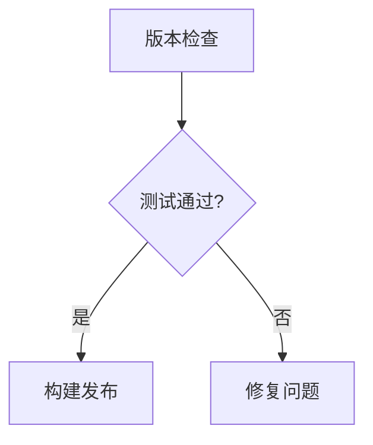

# 31. Hook/插件/扩展系统深度对比

> Hook、插件和扩展系统决定了 AI 编程代理的可扩展性。从"无扩展能力"到"24 事件 + Prompt Hook + 13 插件 marketplace"，差异跨度极大。

## 总览

| Agent | Hook 事件数 | Hook 类型 | 插件/扩展 | Marketplace | Skill 系统 |
|------|-----------|----------|----------|------------|-----------|
| **Claude Code** | **22** | command/http/**prompt** | 13 官方插件 | ✓ | 10+ 内置 Skill |
| **OpenCode** | **17 类型** | npm + file 插件 | Hook-based | ✗ | SKILL.md |
| **Gemini CLI** | 11 | command/runtime | 扩展系统 | ✗ | Markdown Skill |
| **Qwen Code** | 12 | 继承 Gemini | Claude/Gemini 格式转换 | `/extensions` | 继承 |
| **Kimi CLI** | 审批系统 | — | plugin.json（v1.25） | ✗ | Standard + Flow |
| **Copilot CLI** | CLI 参数 | — | YAML agent 定义 | ✗ | 内联 |
| **Goose** | MCP 原生 | MCP 事件 | 58+ 提供商 MCP | Recipe | YAML 模板 |
| **Codex CLI** | 功能标志 | — | 沙箱控制 | ✗ | — |
| **Cline** | hooks/ 目录 | 自定义 | Custom Instructions | 社区 | Workflows |

---

## 一、Claude Code：24 事件 + Prompt Hook + 13 插件（最完整）

> 来源：06-settings.md、05-skills.md、hooks-config.md

### 24 种 Hook 事件

| 类别 | 事件 |
|------|------|
| **工具生命周期** | PreToolUse、PostToolUse、PostToolUseFailure |
| **会话生命周期** | SessionStart、SessionEnd、UserPromptSubmit |
| **代理生命周期** | Stop、StopFailure、SubagentStart、SubagentStop |
| **权限** | PermissionRequest、Elicitation、ElicitationResult |
| **上下文** | PreCompact、PostCompact、InstructionsLoaded |
| **配置** | ConfigChange |
| **任务/团队** | TaskCompleted、TeammateIdle |
| **Worktree** | WorktreeCreate、WorktreeRemove |
| **环境变更**（v2.1.83 新增） | **CwdChanged**、**FileChanged** |
| **通知** | Notification |

### 3 种 Hook 类型

| 类型 | 执行方式 | 独特价值 |
|------|---------|---------|
| **command** | Shell 子进程 | JSON stdin/stdout 通信 |
| **http** | HTTP 请求 | 远程服务集成 |
| **prompt** | **LLM 推理决策** | 语义理解，无需穷举规则 |

**Command Hook 示例**：

```json
{
  "hooks": {
    "PreToolUse": [{
      "matcher": "Bash",
      "hook": {
        "type": "command",
        "command": "node /path/to/check-production.js"
      }
    }]
  }
}
```

Command Hook 通过 stdin 接收 JSON（含 tool_name、tool_input），通过 stdout 返回决策：

```json
// stdin（系统提供）
{ "tool_name": "Bash", "tool_input": { "command": "ssh prod-server" } }

// stdout（Hook 返回）
{ "decision": "block", "reason": "禁止操作生产环境服务器" }
```

决策类型：`approve`（跳过确认）、`deny`（拒绝）、`block`（阻止+消息）、空（正常流程）。

**HTTP Hook 示例**：

```json
{
  "hooks": {
    "PostToolUse": [{
      "matcher": "Edit",
      "hook": {
        "type": "http",
        "url": "https://security.internal/audit",
        "headers": { "Authorization": "Bearer ${AUDIT_TOKEN}" }
      }
    }]
  }
}
```

**Prompt Hook 示例（独有）**：

```json
{
  "hooks": {
    "PreToolUse": [{
      "matcher": "Bash",
      "hook": "prompt-hook: 检查命令是否涉及生产环境"
    }]
  }
}
```

LLM 理解 `ssh prod-server` 和 `kubectl apply -f deployment.yaml` 都是生产操作——传统脚本 Hook 需要逐一枚举，Prompt Hook 让 LLM 推理意图。

### hookify 插件：自动生成 Hook 规则

`hookify` 是 Claude Code 13 个官方插件之一，功能是分析对话模式自动生成 Hook 规则配置。

### 13 官方插件

code-review、pr-review-toolkit、feature-dev、commit-commands、security-guidance、hookify、plugin-dev、agent-sdk-dev、frontend-design、ralph-wiggum、learning-output-style、explanatory-output-style、claude-opus-4-5-migration

**hookify 插件**：分析对话模式，自动生成 Hook 规则。

### Skill 系统

10+ 内置 Skill（/loop、/schedule、/security-review、/pr-comments、/simplify 等），通过 SKILL.md frontmatter 定义。

### Copilot CLI 仓库 Hooks（v1.0.10 新增）

v1.0.10 修复了 `.github/hooks/` 在 `-p`（prompt）模式下不触发的问题。现在仓库级 Hook 在交互模式和管道模式下均正确执行。

```
.github/hooks/
  ├── pre-tool-use.sh    # 工具执行前触发
  └── post-tool-use.sh   # 工具执行后触发
```

### Codex CLI：Plugins 一等公民（v0.117.0）

> 来源：[Codex CLI v0.117.0 Changelog](https://developers.openai.com/codex/changelog)

v0.117.0 将 Plugins 提升为一等公民：
- 启动时自动同步 product-scoped plugins
- `/plugins` 命令浏览、安装、卸载
- 更清晰的认证/设置流程
- User prompt hook 允许在用户提交 prompt 时触发自定义逻辑

### Copilot CLI：Hook 模板变量（v1.0.12）

> 来源：[Copilot CLI v1.0.12 Changelog](https://github.com/github/copilot-cli/blob/main/changelog.md)

v1.0.12 为 Plugin hooks 引入环境变量和模板变量：
- 环境变量：`CLAUDE_PROJECT_DIR`、`CLAUDE_PLUGIN_DATA`（**注**：沿用 Claude Code 生态的变量命名，确保跨工具 Plugin hooks 兼容——Copilot CLI 读取 `.claude/settings.json` 和 Claude Code 插件）
- 模板变量：`{{project_dir}}`、`{{plugin_data_dir}}`（在 hook 配置中使用）
- `/session rename` 无参数时自动从对话历史生成会话名
- `/yolo` 路径权限在 `/clear` 后持久化

### Qwen Code Hooks 自动化系统（v0.12 新增）

Qwen Code v0.12 引入**独立的 Hooks 自动化系统**（非仅继承 Gemini），支持在关键生命周期事件触发自定义命令：
- 自动注入项目上下文
- 自动生成工作摘要日志
- 与 Gemini CLI 的 Hook 系统并行发展

---

## 二、OpenCode：17 种 Hook 类型（最细粒度）

> 来源：01-overview.md、03-architecture.md

### 17 种 Hook 类型

| 类别 | Hook 类型 |
|------|----------|
| **事件** | event |
| **配置** | config、auth |
| **工具** | tool（定义）、tool.definition（修改描述/参数）、tool.execute.before、tool.execute.after |
| **聊天** | chat.message、chat.params、chat.headers |
| **权限** | permission.ask |
| **命令** | command.execute.before |
| **Shell** | shell.env |
| **实验性** | experimental.chat.messages.transform、experimental.chat.system.transform、experimental.session.compacting、experimental.text.complete |

### 插件系统

- **npm 包插件**：Node.js 模块
- **文件插件**：本地文件
- **Hook 驱动扩展**：通过 Hook 修改工具描述、转换聊天参数、控制权限

---

## 三、Gemini CLI：11 事件 + TOML 策略 + 扩展

> 源码：05-policies.md、03-architecture.md

### 11 种 Hook 事件

BeforeTool、AfterTool、BeforeAgent、AfterAgent、BeforeModel、AfterModel、BeforeToolSelection、Notification、SessionStart、SessionEnd、PreCompress

### Hook 配置示例

```json
// settings.json
{
  "hooks": {
    "BeforeTool": [{
      "matcher": "shell",
      "hook": {
        "type": "command",
        "command": "node validate-shell.js"
      }
    }],
    "AfterModel": [{
      "matcher": "*",
      "hook": {
        "type": "runtime",
        "handler": "logModelResponse"
      }
    }]
  }
}
```

### Hook 决策类型

`ask`（请求用户确认）| `block`（阻止+消息）| `deny`（静默拒绝）| `approve`（自动批准）| `allow`（放行）

### 扩展系统

- 扩展定义在 settings.json 的 extensions 数组
- Memory Manager 子代理：专用 Flash 模型管理 GEMINI.md
- 扩展设置为 Tier 2 优先级（5 层体系中）

### Skill（Markdown 格式）

SKILL.md 文件 + frontmatter 元数据，支持条件激活。

---

## 四、Qwen Code：12 事件 + 格式转换（继承 + 增强）

> 来源：qwen-code.md、EVIDENCE.md

### 12 种 Hook 事件

PreToolUse、PostToolUse、PostToolUseFailure、Notification、UserPromptSubmit、SessionStart、SessionEnd、Stop、SubagentStart、SubagentStop、PreCompact、PermissionRequest

### 独有增强：扩展格式转换

自动将 Claude Code 和 Gemini CLI 的扩展格式转换为 Qwen Code 兼容格式。`/extensions` 命令管理安装/卸载/列表。

---

## 五、Kimi CLI：plugin.json + Flow Skill

> 源码：soul/slash.py、Wire v1.6

### Plugin 系统（v1.25.0 新增）

```json
// ~/.kimi/plugins/my-plugin/plugin.json
{
  "name": "my-plugin",
  "version": "1.0",
  "tools": [...]
}
```

- 隔离子进程执行
- stdin/stdout JSON 通信
- **凭证自动注入**：从 LLM 配置注入 api_key + base_url（含 OAuth token 刷新）

### Flow Skill（独有）

Skill 文件中嵌入 Mermaid/D2 图表定义工作流：

```markdown
---
name: release-flow
---

```

Kimi CLI 解析图表并按流程执行各步骤。

---

## 六、Copilot CLI：YAML 代理定义

> 来源：03-architecture.md

### 代理 YAML 格式

```yaml
# definitions/code-review.agent.yaml
name: code-review
model: claude-sonnet-4.5
tools: ["*"]
promptParts:
  system: |
    You are an expert code reviewer...
  instructions: |
    Review methodology: ...
```

- 3 个内置代理（code-review、explore、task）
- 自定义代理通过 YAML 文件定义
- 工具权限按代理配置（不是全局 Hook）

### CLI 参数控制

```bash
--allow-all-tools
--allow-tool <name>
--deny-tool <name>
--available-tools <list>
```

---

## 七、Goose：MCP 原生扩展

> 来源：goose.md、EVIDENCE.md

### 全 MCP 驱动

所有工具通过 MCP 服务器提供。扩展 = MCP 服务器。

### Recipe 系统

YAML/JSON 定义的可复用任务模板 + Cron 调度（`goose schedule`）。

### SmartApprove

默认审批模式：仅敏感操作需要确认，低风险操作自动放行。

---

## Hook 事件覆盖对比

| 事件类型 | Claude Code | Gemini CLI | Qwen Code | OpenCode |
|---------|------------|-----------|-----------|----------|
| 工具执行前 | ✓ PreToolUse | ✓ BeforeTool | ✓ PreToolUse | ✓ tool.execute.before |
| 工具执行后 | ✓ PostToolUse | ✓ AfterTool | ✓ PostToolUse | ✓ tool.execute.after |
| 工具失败 | ✓ PostToolUseFailure | ✗ | ✓ PostToolUseFailure | ✗ |
| 模型调用前 | ✗ | ✓ BeforeModel | ✗ | ✗ |
| 模型调用后 | ✗ | ✓ AfterModel | ✗ | ✗ |
| 会话开始 | ✓ SessionStart | ✓ SessionStart | ✓ SessionStart | ✓ event |
| 会话结束 | ✓ SessionEnd | ✓ SessionEnd | ✓ SessionEnd | ✓ event |
| 压缩前 | ✓ PreCompact | ✓ PreCompress | ✓ PreCompact | ✓ experimental |
| 压缩后 | ✓ PostCompact | ✗ | ✗ | ✗ |
| 权限请求 | ✓ PermissionRequest | ✗ | ✓ PermissionRequest | ✓ permission.ask |
| 配置变更 | ✓ ConfigChange | ✗ | ✗ | ✓ config |
| 工具定义修改 | ✗ | ✗ | ✗ | ✓ tool.definition |

> **Claude Code 独有**：PostCompact、TaskCompleted、TeammateIdle、ConfigChange、WorktreeCreate/Remove、Elicitation/Result
> **Gemini CLI 独有**：BeforeModel、AfterModel、BeforeToolSelection、BeforeAgent、AfterAgent
> **OpenCode 独有**：tool.definition（运行时修改工具 schema）、shell.env、chat.params/headers

---

## 扩展生态成熟度

| 维度 | Claude Code | Gemini CLI | Goose | OpenCode | 其他 |
|------|------------|-----------|-------|----------|------|
| 官方插件数 | **13** | ~5 扩展 | MCP 驱动 | npm 包 | 0-3 |
| Marketplace | **✓** | ✗ | ✗ | ✗ | ✗ |
| 社区插件 | 增长中 | 扩展生态 | MCP 生态 | Hook 生态 | 少量 |
| 格式转换 | — | — | — | — | ✓ Qwen |
| Skill 系统 | **10+ 内置** | Markdown | Recipe | SKILL.md | 1-3 |

---

## 证据来源

| Agent | 来源 | 获取方式 |
|------|------|---------|
| Claude Code | 06-settings.md + 05-skills.md + hooks-config.md | 二进制分析 + 文档 |
| OpenCode | 01-overview.md + 03-architecture.md | 开源 |
| Gemini CLI | 05-policies.md + 03-architecture.md | 开源 |
| Qwen Code | qwen-code.md + EVIDENCE.md | 开源 |
| Kimi CLI | 03-architecture.md + EVIDENCE.md | 开源 |
| Copilot CLI | 03-architecture.md | SEA 反编译 |
| Goose | goose.md + EVIDENCE.md | 开源 |
